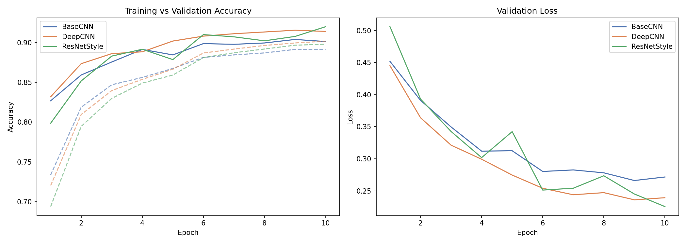
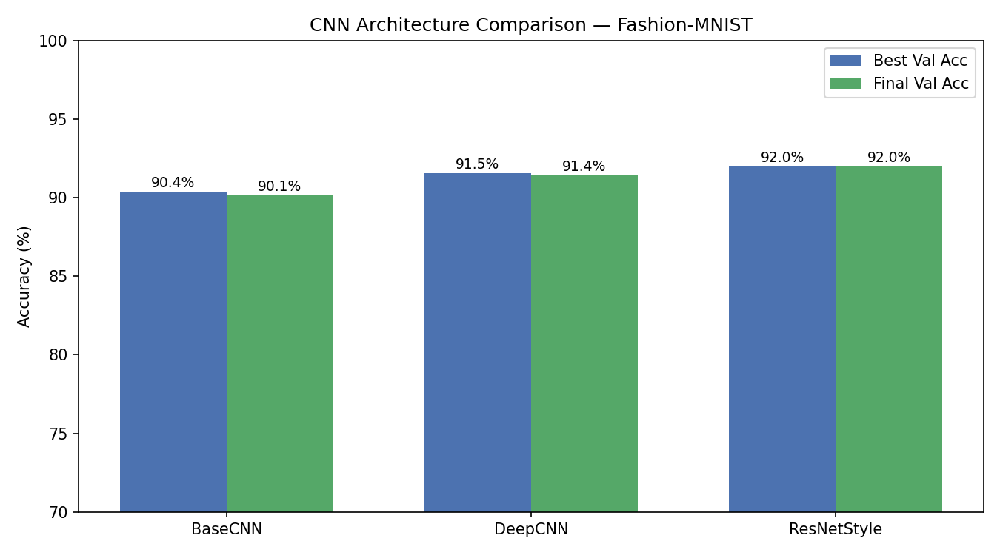

# Deep Learning Image Classification Study

Benchmarking 3 CNN architectures on Fashion-MNIST (70,000 images, 10 classes).

## Tech Stack
Python · PyTorch · torchvision · matplotlib · seaborn

## Results

### Training Curves


### Architecture Comparison


## Model Benchmarks
| Model | Best Val Accuracy |
|---|---|
| BaseCNN | 90.38% |
| DeepCNN | 91.54% |
| **ResNetStyle** | **91.98%** |

ResNetStyle achieves 91.98% validation accuracy, outperforming BaseCNN by 1.6% through residual connections, BatchNorm and targeted augmentation.

## Project Structure
deep-learning-cnn/
├── src/
│   ├── data_loader.py   # Fashion-MNIST with augmentation
│   ├── models.py        # BaseCNN, DeepCNN, ResNetStyle
│   ├── trainer.py       # training loop, evaluation
│   └── visualise.py     # training curves, accuracy charts
├── results/             # metrics.json + plots
├── main.py              # master script
├── requirements.txt
└── README.md

## How to Run
```bash
python3 -m venv venv
source venv/bin/activate
pip install -r requirements.txt
python main.py
```

## Output
- `results/metrics.json` — best and final val accuracy per model
- `results/training_curves.png` — train vs val accuracy over epochs
- `results/accuracy_comparison.png` — bar chart comparing all 3 models
